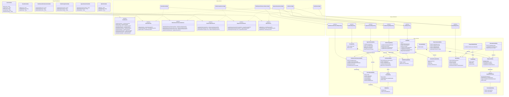

```mermaid
classDiagram
direction TB

namespace Capa_Presentacion {
    class LoteController {
        +listarLotes() String
        +registrarLote() String
        +iniciarLote() String
        +cancelarLote() String
        +finalizarEnvasado() String
    }
    class RecetaController {
        +altaReceta() String
        +modificarReceta() String
        +bajaReceta() String
    }
    class PlanificacionProduccionController {
        +registrarPlanificacion() String
        +anularPlanificacion() String
        +finalizarPlanificacion() String
    }
    class OrdenCompraController {
        +registrarOrdenCompra() String
        +anularOrdenCompra() String
        +finalizarOrdenCompra() String
    }
    class IngresoInsumoController {
        +registrarIngresoPorCompra() String
        +registrarIngresoDirecto() String
        +anularIngreso() String
    }
    class BarrilController {
        +altaBarril() String
        +modificarBarril() String
        +bajaBarril() String
    }
}

namespace Capa_Servicio {
    class ILoteServicio {
        <<interface>>
        +registrarLote(form) LoteResponseDTO
        +iniciarLote(id) LoteResponseDTO
        +cancelarLote(id, form) LoteResponseDTO
        +finalizarMolienda(id) LoteResponseDTO
        +finalizarMaceracion(id) LoteResponseDTO
        +finalizarHervido(id) LoteResponseDTO
        +finalizarFermentacion(id) LoteResponseDTO
        +finalizarMaduracion(id) LoteResponseDTO
        +finalizarEnvasado(id) LoteResponseDTO
    }
    class LoteServicioImpl
    class IRecetaServicio {
        <<interface>>
        +altaReceta(form) RecetaResponseDTO
        +modificarReceta(id, form) RecetaResponseDTO
        +bajaReceta(id) RecetaResponseDTO
    }
    class RecetaServicioImpl
    class IPlanificacionProduccionServicio {
        <<interface>>
        +registrarPlanificacionProduccion(form) PlanificacionResponseDTO
        +anularPlanificacionProduccion(id, form) PlanificacionResponseDTO
        +finalizarPlanificacionProduccion(id, form) PlanificacionResponseDTO
        +sugerirFechaFinalizacion() SugerenciaFechaDTO
    }
    class PlanificacionProduccionServicioImpl
    class IOrdenCompraServicio {
        <<interface>>
        +registrarOrdenCompra(form) OrdenCompraResponseDTO
        +anularOrdenCompra(id, form) OrdenCompraResponseDTO
        +finalizarOrdenCompra(id, form) OrdenCompraResponseDTO
    }
    class OrdenCompraServicioImpl
    class IIngresoInsumoServicio {
        <<interface>>
        +registrarIngresoInsumoPorCompra(form) IngresoResponseDTO
        +registrarIngresoInsumoDirecto(form) IngresoResponseDTO
        +anularIngresoInsumo(id, form) IngresoResponseDTO
    }
    class IngresoInsumoServicioImpl
    class IBarrilServicio {
        <<interface>>
        +altaBarril(form) BarrilResponseDTO
        +modificarBarril(id, form) BarrilResponseDTO
        +bajaBarril(id) BarrilResponseDTO
    }
    class BarrilServicioImpl
}

namespace Capa_Persistencia {
    class ILoteRepository {
        <<interface>>
    }
    class IRecetaRepository {
        <<interface>>
    }
    class IPlanificacionProduccionRepository {
        <<interface>>
    }
    class IOrdenCompraRepository {
        <<interface>>
    }
    class IIngresoInsumoRepository {
        <<interface>>
    }
    class IBarrilRepository {
        <<interface>>
    }
}

namespace Capa_Dominio {
    class LoteEntity {
        -Long id
        -String identificadorInterno
        -Double volumenObjetivo
        -EstadoLote estado
        -LocalDate fechaInicioEstimada
        -LocalDateTime fechaInicio
        -LocalDateTime fechaFinalizacion
        -String motivoCancelacion
    }
    class EtapaLoteEntity {
        -TipoEtapa etapa
        -EstadoEtapaLote estado
        -LocalDateTime fechaInicio
        -LocalDateTime fechaFinalizacion
    }
    class ReservaInsumoEntity {
        -Double cantidadReservada
        -Double cantidadConsumida
        -Double cantidadLiberada
        -Double cantidadPendiente
        -EstadoReservaInsumo estado
    }
    class EnvasadoLoteEntity {
        -Double cantidadEnvasada
        -LocalDateTime fechaEnvasado
        -EstadoTransaccion estado
    }
    class PlanificacionProduccionEntity {
        -Double cantidadAProducir
        -LocalDate fechaInicioEstimada
        -LocalDate fechaFinalizacionEstimada
        -EstadoSolicitud estado
        -PrioridadPlanificacion prioridad
    }
    class RecetaEntity {
        -Long contadorLotes
        -Estado estado
    }
    class VersionRecetaEntity {
        -String nombre
        -Double volumenBase
        -Double ogObjetivo
        -Double fgObjetivo
        -Double ibuObjetivo
        -boolean esUltimaVersion
    }
    class InsumoEntity {
        <<abstract>>
        -String nombre
        -UnidadDeMedida unidadDeMedida
        -Estado estado
    }
    class MaltaEntity {
        -TipoMalta tipo
        -Integer potencialExtracto
    }
    class LoteInsumoEntity {
        -String identificacionLoteProveedor
        -Double cantidadActual
        -Double cantidadReservada
        -LocalDate fechaVencimiento
        -BigDecimal costoUnitarioPPP
    }
    class IngresoInsumoEntity {
        -LocalDate fechaIngreso
        -Double cantidadRecibida
        -BigDecimal costoUnitario
        -TipoIngreso tipoIngreso
        -EstadoTransaccion estado
    }
    class OrdenCompraEntity {
        -LocalDate fechaEntregaEstimada
        -EstadoSolicitud estado
        -LocalDateTime fechaFinalizacion
        -LocalDateTime fechaAnulacion
    }
    class DetalleCompraEntity {
        -Integer cantidad
        -BigDecimal costoUnitario
    }
    class ProveedorEntity {
        -Estado estado
    }
    class VersionProveedorEntity {
        -String razonSocial
        -String cuit
        -String email
        -boolean esUltimaVersion
    }
    class EquipamientoEntity {
        <<abstract>>
        -String identificadorInterno
        -EstadoOperativo estadoOperativo
        -Integer usosMaximosAntesMantenimiento
        -Estado estado
    }
    class FermentadorEntity {
        -Double capacidadTotal
        -Double capacidadUtil
    }
    class BarrilEntity {
        -String identificadorInterno
        -String numeroSerie
        -Double capacidad
        -Double contenidoActual
        -EstadoOperativoBarril estadoOperativo
    }
    class DespachoBarrilEntity {
        -LocalDate fechaDevolucionEstimada
    }
    class ClienteEntity {
        -String nombre
        -String email
        -Estado estado
    }
}

%% Presentation to Service
LoteController --> ILoteServicio
RecetaController --> IRecetaServicio
PlanificacionProduccionController --> IPlanificacionProduccionServicio
OrdenCompraController --> IOrdenCompraServicio
IngresoInsumoController --> IIngresoInsumoServicio
BarrilController --> IBarrilServicio

%% Service realization
LoteServicioImpl ..|> ILoteServicio
RecetaServicioImpl ..|> IRecetaServicio
PlanificacionProduccionServicioImpl ..|> IPlanificacionProduccionServicio
OrdenCompraServicioImpl ..|> IOrdenCompraServicio
IngresoInsumoServicioImpl ..|> IIngresoInsumoServicio
BarrilServicioImpl ..|> IBarrilServicio

%% Service to Repository
LoteServicioImpl --> ILoteRepository
LoteServicioImpl --> IBarrilRepository
RecetaServicioImpl --> IRecetaRepository
PlanificacionProduccionServicioImpl --> IPlanificacionProduccionRepository
PlanificacionProduccionServicioImpl --> ILoteRepository
OrdenCompraServicioImpl --> IOrdenCompraRepository
IngresoInsumoServicioImpl --> IIngresoInsumoRepository
IngresoInsumoServicioImpl --> IOrdenCompraRepository
BarrilServicioImpl --> IBarrilRepository

%% Repository to Entity
ILoteRepository --> LoteEntity
IRecetaRepository --> RecetaEntity
IPlanificacionProduccionRepository --> PlanificacionProduccionEntity
IOrdenCompraRepository --> OrdenCompraEntity
IIngresoInsumoRepository --> IngresoInsumoEntity
IBarrilRepository --> BarrilEntity

%% Domain relations
LoteEntity "*" --> "1" PlanificacionProduccionEntity : planificacionProduccion
LoteEntity "1" *-- "*" EtapaLoteEntity : etapas
EtapaLoteEntity "*" --> "1" EquipamientoEntity : equipamiento
ReservaInsumoEntity "*" --> "1" EtapaLoteEntity : etapaLote
ReservaInsumoEntity "*" --> "1" LoteInsumoEntity : loteInsumo
EnvasadoLoteEntity "*" --> "1" EtapaLoteEntity : etapaLote
EnvasadoLoteEntity "*" --> "1" BarrilEntity : barril
PlanificacionProduccionEntity "*" --> "1" VersionRecetaEntity : versionReceta
RecetaEntity "1" *-- "1..*" VersionRecetaEntity : versiones
VersionRecetaEntity "*" --> "*" MaltaEntity : DetalleMalta
InsumoEntity <|-- MaltaEntity
LoteInsumoEntity "*" --> "1" InsumoEntity : insumo
IngresoInsumoEntity "*" --> "1" LoteInsumoEntity : loteInsumo
IngresoInsumoEntity "*" --> "0..1" DetalleCompraEntity : detalleCompra
OrdenCompraEntity "1" *-- "1..*" DetalleCompraEntity : detallesCompra
OrdenCompraEntity "*" --> "1" PlanificacionProduccionEntity : planificacionProduccion
OrdenCompraEntity "*" --> "1" VersionProveedorEntity : versionProveedor
ProveedorEntity "1" *-- "1..*" VersionProveedorEntity : versiones
EquipamientoEntity <|-- FermentadorEntity
DespachoBarrilEntity "*" --> "1" BarrilEntity : barril
DespachoBarrilEntity "*" --> "1" ClienteEntity : cliente
```
